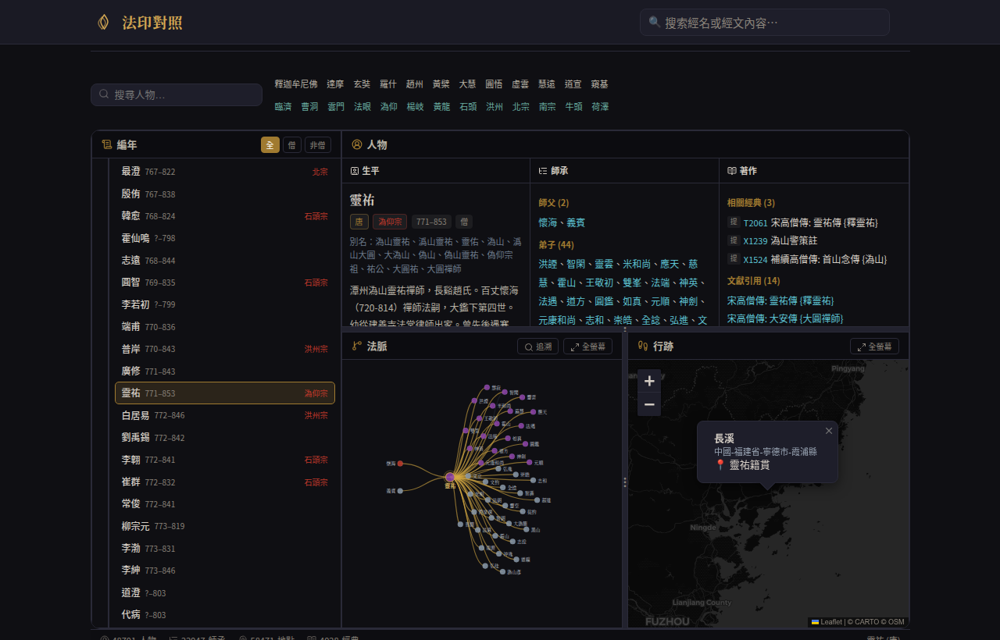
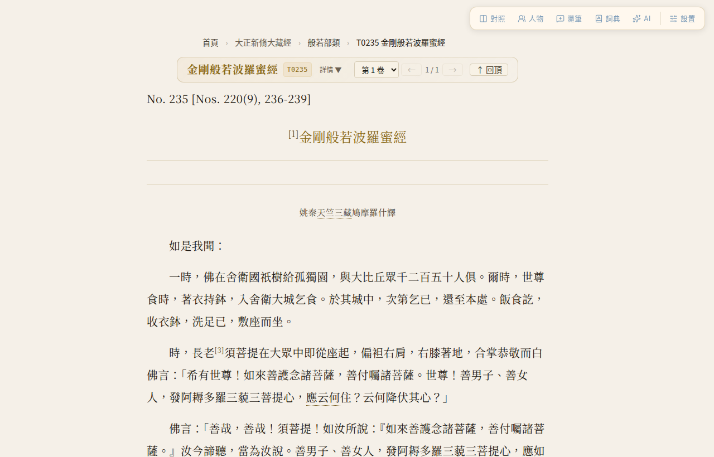
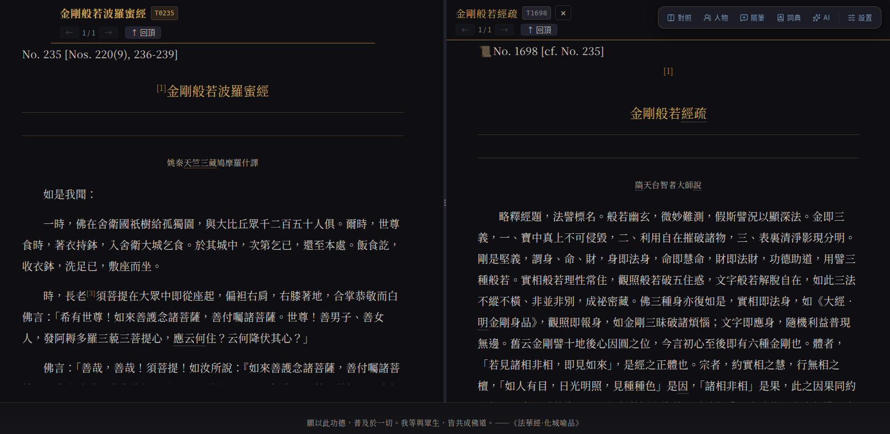

# 法印对照 (Fa-Yin)

一个**本地优先**的佛经阅读工具。

CBETA 的原始数据是 XML，官方客户端有 Windows 版和 macOS 版，但没有 Linux 版，而我主力用 Ubuntu。于是自己写了这个工具，把 XML 一键转成可阅读的网页，顺便把词典、注疏对照、法脉图谱等辅助功能都做在了一起。基于浏览器，天然跨平台，Windows 和 macOS 也能用。

> **注意**：本项目代码不含任何经文数据。需要用户自行从 [CBETA 官网](https://www.cbeta.org/download) 下载指定的经文数据包 `CBETA CBReader 2X 經文資料檔` (注: 若官网有更新，请下载最新版本) ，首次启动时脚本会引导你完成。

---

## 1. 为什么做这个

阅藏既是闻思，亦属定课。其应有之境，当是制心一处，如临灵山法会。

我在2014年开始执笔抄经，同时发心阅藏。七年后《华严经》八十卷抄写完成，阅藏进度却依然慢如蜗牛。究其原因，除了经文浩瀚且个人力浅外，工具割裂亦是大碍。经卷在此，注疏在彼，词典又散见他处。虽有 CBETA 数字化成果，但难免在多个窗口间频繁切换、分屏对照。这种琐碎操作极易打断思绪。

若有一方工具，能将散落卷帙收摄于同一案头，该多好。这个想法搁置了多年，直到近年来 AI 辅助编程突飞猛进，才让我有了动手的勇气。于是趁丙午年春节假期，在 AI 的协助下“独立”完成了这个项目。

回头望去，当年那点执念种子，终究等到了发芽的季节。狂心暂歇。

---

## 2. 截图

<table>
  <tr>
    <td></td>
    <td></td>
  </tr>
  <tr>
    <td></td>
    <td></td>
  </tr>
  <tr>
    <td></td>
    <td></td>
  </tr>
</table>

---

## 3. 核心功能

| 功能 | 说明 |
|------|------|
| **经文阅读** | 横排/竖排双模式，简繁一键切换，HTMX 无刷新翻卷 |
| **划词词典** | 内置 6 部词典，双击即查，支持自定义词典文件 |
| **经疏对照** | 经文与注疏左右分屏，随文对读，支持自定义添加 |
| **同经异译** | 多个译本左右分栏对照，可自由组合添加 |
| **全文搜索** | SQLite FTS5 毫秒级检索，繁简通搜 |
| **AI 释义** | 选一段文字，让 AI 帮你翻译/解释（支持 DeepSeek、Ollama 本地模型等） |
| **祖师法脉** | D3.js 交互式师承图 + Leaflet 行迹地图 + 编年表 |
| **九宫书架** | 预设 9 大修学门类及经论，以作示例，可自定义增删改，编辑模式下随意拖动次序 |
| **每日偈颂** | 365 条佛言祖语，一日一则，可自撰，可置顶 |
| **闪念笔记** | 读到有感触的地方随手记，按日期自动归档 |
| **贝阙经藏** | 全藏部类或经藏目录树状浏览，模糊搜索 |
| **本地优先** | 所有数据在你自己电脑上，不依赖在线服务（AI 释义和查看 CBETA 原版 PDF 页面除外） |
| **三套字体** | 思源宋体 + 文津宋体（现代规范）、字雲（疏朗明朝）、纳米老宋（复古墨晕），覆盖 CJK Ext.A–J 及 IVD |
| **完整标记** | 行号、校勘、注释完整保留，可与纸本精确对照 |
| **零构建前端** | 没有 npm、没有 Webpack，改一行代码刷新就能看 |
| **一键启动** | `python launcher.py`，自动检测数据、下载引导、数据库构建、启动服务 |

---

## 4. 技术栈

| 层级 | 技术 | 说明 |
|------|------|------|
| 后端 | [FastAPI](https://fastapi.tiangolo.com) · [Jinja2](https://jinja.palletsprojects.com) | SSR 渲染，Python 单语言全栈 |
| 交互 | [HTMX](https://htmx.org) · [Alpine.js](https://alpinejs.dev) | 无需前端构建工具 |
| 数据 | [SQLite](https://sqlite.org) · FTS5 | 全文检索，毫秒级响应 |
| 可视化 | [D3.js](https://d3js.org) · [Leaflet](https://leafletjs.com) | 法脉图谱与行迹地图 |

---

## 5. 安装与运行

> **环境要求**：Python 3.10+（一键启动脚本会自动检测并引导安装）

### 方式一：一键启动（推荐）

**Windows 用户**：下载项目后双击 `start.bat`，启动安装脚本。

> **⚠️ Windows 安全提示**：从浏览器下载的压缩包会被 Windows 标记为"来自互联网"，解压后的 `.bat` 文件可能会提示"已被阻止"而无法运行。解决方法（任选其一）：
> 1. **解压前**：右键 `.zip` 文件 → 属性 → 勾选底部的 **"解除锁定"** → 确定，然后再解压
> 2. **已解压**：系统自带的解压方式可能仍然被阻止，那么在解压目录中打开 PowerShell，运行以下命令批量解除锁定：
>    ```powershell
>    Get-ChildItem -Recurse | Unblock-File
>    ```
> 3. 使用 [7-Zip](https://www.7-zip.org) 等第三方工具解压（一般不会传播锁定标记）
> 4. 改用 `git clone` 下载（见下方 macOS / Linux 的命令）
> 5. **右键 `start.bat` → 以管理员身份运行**（⚠️ 不推荐：管理员权限下 Python 及所有依赖包将拥有系统最高权限，且创建的文件可能导致后续普通用户运行时权限不足。养成"遇到阻止就用管理员运行"的习惯存在安全风险，建议优先使用前四种方法）

**macOS / Linux 用户**：

```bash
git clone https://github.com/maolibu/fa-yin.git
cd fa-yin
chmod +x start.sh && ./start.sh
```

> 启动脚本会自动完成：检测/安装 Python → 创建虚拟环境 → 安装依赖 → 检测 CBETA 数据（缺失则引导下载）→ 构建搜索数据库（首次约 5–15 分钟）→ 启动浏览器。

### 方式二：手动安装

如果你熟悉 Python：

```bash
git clone https://github.com/maolibu/fa-yin.git
cd fa-yin
pip install -r requirements.txt
python launcher.py
```

**可选参数**：

```bash
python launcher.py --port 8080    # 指定端口（默认 8400）
python launcher.py --check        # 仅运行数据自检
python launcher.py --no-browser   # 不自动打开浏览器
python launcher.py --skip-build   # 跳过数据库构建
```

### 方式三：Docker 部署

```bash
docker build -t fa-yin .
docker run -p 8400:8400 \
  -v /path/to/cbeta:/app/data/raw/cbeta \
  -v fa-yin-db:/app/data/db \
  -v fa-yin-userdata:/app/data/user_data \
  fa-yin
```

> **提示**：如果您想在绿联 NAS (如 DX4600) 或装有 1Panel 面板的云服务器 (VPS) 上通过 Docker Compose 部署，请参考详细教程：[NAS 与 1Panel 部署指南](docs/deploy_nas_1panel.md)。

---

## 6. 项目结构

```
fa-yin/
├── launcher.py          # 一键启动脚本
├── src/
│   ├── main.py          # FastAPI 入口
│   ├── config.py        # 全局配置
│   ├── core/            # 核心模块：XML 解析、导航、偈颂、词典
│   ├── routers/         # 路由：阅读器、搜索、词典、法脉、AI …
│   ├── etl/             # 数据库构建脚本
│   ├── templates/       # Jinja2 模板
│   └── static/          # CSS / JS / 字体
├── data/
│   ├── raw/cbeta/       # CBETA 原始数据（用户自行下载）
│   ├── db/              # SQLite 数据库（ETL 生成）
│   └── user_data/       # 用户笔记、收藏、偏好
├── tools/               # 辅助工具（词典转换、偈颂提取等）
├── tests/               # 测试脚本
└── scripts/             # 地图瓦片下载等脚本
```

### 用户数据

个人笔记、收藏、偏好等数据全部保存在 `data/user_data/` 目录下：

| 文件 | 内容 |
|------|------|
| `notes/` | 闪念笔记（每日一个 Markdown 文件），可直接用 Obsidian 打开 |
| `favorites.json` | 九宫书架收藏 |
| `preferences.json` | 显示偏好（字体、主题、排版等） |
| `verses_custom.json` | 自定义偈颂 |
| `commentary_map.user.json` | 自定义经疏对照映射 |

**备份只需复制 `data/user_data/` 整个文件夹即可。首页自带快捷方式。**

### Obsidian 联动

首次启动时，launcher 会自动将全部 CBETA XML 转为 Markdown 文件，输出到 `obsidian_vault/` 目录。你可以直接在 Obsidian 中将该文件夹作为 Vault 打开，用 Obsidian 的双向链接、图谱等功能辅助研读。笔记文件同为 Markdown 格式，指定 Obsidian 仓库路径或将 `data/user_data/notes/` 同步/复制过去即可联动。

---

## 7. 声明

本项目不含任何经文数据，仅提供 XML 解析、数据库构建与全文检索的通用算法实现。该技术框架同样适用于《全唐诗》、《二十四史》等大型古籍的数字化整理。

本项目设计为 **Localhost** 个人学习用途。未经相关行政许可，**不得**用于搭建公开访问的互联网宗教信息服务平台！欢迎拥有合法资质的宗教团体、学术机构或公益组织使用本代码构建内部或公开服务，但须自行取得相应许可。

本项目由 AI 辅助编码完成。虽然通过数据分析逻辑确保了核心功能的实现，但由于开发周期较短，测试尚不充分，细节处难免存在 Bug。如果您在使用中发现问题：欢迎提交 Issue 反馈建议；欢迎提交 Pull Request 协助完善。

---

## 8. 致谢

**数据**
- 经文与目录：[CBETA](https://www.cbeta.org/download)（CC BY-NC-SA 2.5 TW）
- 人名/地名/时间：[DILA 佛学规范资料库](https://authority.dila.edu.tw)（CC BY-SA 3.0）
- 词典：主要来自 [CBETA](https://www.cbeta.org/download) 和 [华夏佛典宝库](https://www.fodian.net/)（域名可能已变更），具体包括，丁福保《佛學大辭典》、Soothill–Hodous 漢英佛學詞典、法相辞典（朱芾煌 编, 1939）、三藏法数（明·一如等 撰）、祖庭事苑（北宋·陈善卿），以及通用汉语词典 [萌典](https://github.com/g0v/moedict-data)（原文 CC BY-ND 3.0 TW；格式转换部分 CC0）

**字体**
- [Source Han Serif / 思源宋体](https://github.com/adobe-fonts/source-han-serif) · [Source Han Sans / 思源黑体](https://github.com/adobe-fonts/source-han-sans)（Adobe · Google, OFL 1.1）
- [WenJin Mincho / 文津宋体](https://github.com/takushun-wu/WenJinMincho)（OFL 1.1）
- [Jigmo / 字雲](https://kamichikoichi.github.io/jigmo/)（CC0 1.0）
- [NanoOldSong / 纳米老宋](https://github.com/Hansha2011/NanoOldSong)

**AI**
- 开发过程中使用 Google Antigravity 和 GitHub Copilot 作为编程助手（代码生成/重构/排错等）
- 运行时“AI 释义”为可选功能，由用户自行配置第三方（Token 费用）或本地模型服务（显卡+电费）

**技术栈**
- [FastAPI](https://fastapi.tiangolo.com) (MIT) · [HTMX](https://htmx.org) (BSD) · [Alpine.js](https://alpinejs.dev) (MIT) · [D3.js](https://d3js.org) (ISC) · [Leaflet](https://leafletjs.com) (BSD) · [Lucide](https://lucide.dev) (ISC) · [OpenCC](https://github.com/BYVoid/OpenCC) (Apache-2.0) · [Split.js](https://split.js.org) (MIT)

---

## 9. 许可证

代码采用 [AGPL-3.0](LICENSE) 许可证。经文数据等版权归 CBETA 及相关机构所有。
