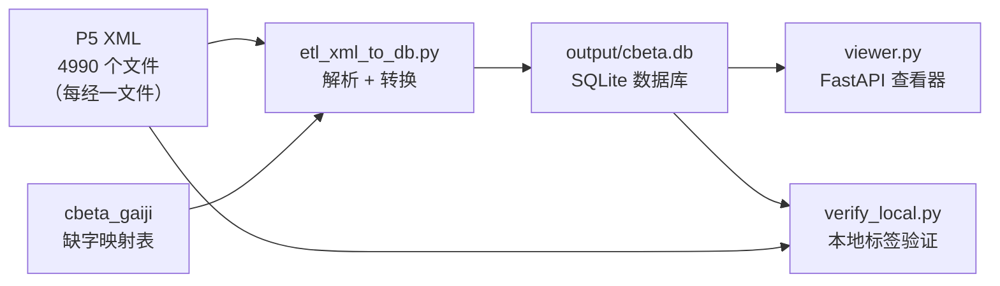

# etl — CBETA 数据构建工程

> 将 CBETA TEI P5 XML 佛经语料转换为 SQLite 数据库，供法印对照平台使用。

## 整体流程



## 目录结构

```
10_etl/
├── etl_xml_to_db.py              # 主转换脚本 ⭐ (XML → cbeta.db)
├── etl_bookcase_nav.py           # 导航库构建脚本 ⭐ (Bookcase → cbeta_nav.db)
├── gaiji_map.py                  # Gaiji 缺字映射模块（被主脚本 import）
├── schema/
│   └── schema.sql                # 数据库建表语句（6 张表 + FTS5）
├── tools/                        # 辅助工具脚本
│   ├── verify_local.py           # 本地验证（XML vs DB 逐经对比，4841 经全量）
│   ├── verify_against_cbeta.py   # CBETA API 自动校对（远程抽样对比）
│   ├── verify_nav.py             # 导航库数据质量验证
│   ├── export_catalog.py         # 综合目录导出（CSV/XLSX，含部类、字数统计）
│   └── scan_xml_tags.py          # XML 标签审计（114 种标签覆盖率分析）
├── output/                       # 输出目录（不纳入 Git）
│   ├── cbeta.db                  # 经文数据库（~5 GB）
│   ├── cbeta_nav.db              # 导航/目录数据库（~35 MB）
│   ├── verify_local_report.json  # 验证报告
│   └── tag_scan_report.json      # 标签审计报告
├── logs/                         # 日志
│   └── etl_run_*.log             # 转换运行日志
└── code_review.md                # 代码审查报告（含标签覆盖分析、设计决策）
```

## 核心转换流程（etl_xml_to_db.py）

转换分 4 步：

### 第 1 步：解析 XML

```
T01n0001.xml  →  ET.fromstring(f.read())  →  ElementTree 对象
```

数据源为 P5 版（每经一个文件，如 `T01n0001.xml`）。使用 Python 标准库 `xml.etree.ElementTree`，以 `fromstring` 替代 `parse` 避免某些环境下的 IO 阻塞。

### 第 2 步：提取元数据

从 `<teiHeader>` 中获取：

- 经号（如 `T0001`）、藏经（`T` = 大正藏）
- 经名（`長阿含經`）、作者（`後秦 佛陀耶舍共竺佛念譯`）
- 卷数（`22`）

### 第 3 步：按卷切分正文

P5 版每经一个文件（如 `T01n0001.xml` = 长阿含经全 22 卷），卷分界由 `<milestone unit="juan">` 标记。有 61 部经跨越多个卷册文件夹（如 GA0037 在 GA036 和 GA037 两个目录中各有一个文件），ETL 使用首次 DELETE + 后续追加的策略合并。

代码深度优先遍历整个 `<body>`：

1. 遇到 milestone → 切换当前卷号，保存之前的内容
2. 检查每个子元素子树是否含 milestone
   - **有** → 递归进入卷切分逻辑
   - **没有** → 委托给统一的 `get_html_recursive` / `get_text_recursive` 处理

这保证了无论标签嵌套多深，都只需维护一套处理逻辑。

### 第 4 步：生成 HTML 和纯文本

嵌套标签的处理示例：

```xml
<lg>                          ← div.verse
  <l>如是我聞<caesura/>        ← span.verse-line + span.caesura
    <g ref="#CB001"/>          ← span.gaiji
  </l>
</lg>
```

```html
<div class="verse">
  <span class="verse-line"
    >如是我聞<span class="caesura">　</span>
    <span class="gaiji" data-cb="CB001">字</span>
  </span>
</div>
```

纯文本只取文字内容，供全文检索用。

### 附加提取

| 提取项 | 数据来源                          | 存入表      |
| ------ | --------------------------------- | ----------- |
| 校勘记 | `<back>` 中的 `<app>/<lem>/<rdg>` | `apparatus` |
| 注释   | `<body>` 中的 `<note>`            | `notes`     |
| 目录   | `<body>` 中的 `<cb:mulu>`         | `toc`       |

> P5 版 XML 中校勘记位于 `<back>` 节（文末），`extract_apparatus` 优先查 `<back>`，不存在则退而查 `<body>`。

### XML 标签速查（78 个标签）

**文档结构**（TEI 信封，用于提取元数据）

| 标签                                             | 用途                                    |
| ------------------------------------------------ | --------------------------------------- |
| `TEI` / `teiHeader` / `text` / `body`            | 文档骨架                                |
| `fileDesc` / `titleStmt` / `title` / `author`    | 经名、作者 → catalog 表                 |
| `idno`                                           | 经号/册号/藏经编号 → 文件识别核心       |
| `extent`                                         | 卷数（如「18卷」）→ catalog 表          |
| `editionStmt` / `publicationStmt` / `sourceDesc` | 版本和来源信息                          |
| `encodingDesc` / `editorialDecl` / `punctuation` | 编码和标点体例                          |
| `revisionDesc` / `change` / `date`               | 修订日志                                |
| `respStmt` / `resp` / `name`                     | 校对者                                  |
| `listWit` / `witness` / `language`               | 版本来源、语言                          |
| `charDecl` / `char` / `charName`                 | 缺字声明区                              |
| `charProp` / `localName` / `value` / `mapping`   | 缺字属性（Unicode、组字式）→ gaiji 解析 |

**正文内容**（ETL 核心处理对象）

| 标签                  | 用途                           | 重要性         |
| --------------------- | ------------------------------ | -------------- |
| `div`                 | 章节分区                       | 结构           |
| `p`                   | 段落                           | ⭐ 正文段落    |
| `lb`                  | 换行标记（含行号如 `0311b02`） | ⭐ 行号定位    |
| `pb`                  | 换页标记                       | 页码定位       |
| `milestone`           | 卷分界（`unit="juan"`）        | ⭐ 卷切分依据  |
| `head`                | 品名、章节名                   | 结构           |
| `juan` / `jhead`      | 卷标记和卷头                   | 卷信息         |
| `byline`              | 作者/译者署名行                | 署名           |
| `g`                   | 缺字引用（`<g ref="#CB001">`） | ⭐ gaiji 替换  |
| `note`                | 注释（夹注/脚注/校勘）         | ⭐ → notes 表  |
| `mulu`                | 目录条目                       | → toc 表       |
| `app` / `lem` / `rdg` | 校勘三件套                     | → apparatus 表 |

**文本格式**

| 标签                          | 用途                   |
| ----------------------------- | ---------------------- |
| `lg` / `l` / `caesura`        | 偈颂组/行/停顿         |
| `list` / `item`               | 列表                   |
| `table` / `row` / `cell`      | 表格                   |
| `entry` / `form` / `def`      | 辞典条目（音义类经典） |
| `tt` / `t`                    | 梵中/巴中对照翻译      |
| `figure` / `graphic`          | 图片                   |
| `space` / `unclear` / `event` | 空位/模糊字/事件       |

**P5 版独有**

| 标签     | 用途                                                                                   |
| -------- | -------------------------------------------------------------------------------------- |
| `back`   | 校勘附录区（P5 版在文末，ETL 优先从此处提取校勘）                                      |
| `anchor` | 校勘锚点，标记被校勘字的起止位置（`beg.../end...`），与 `<back>` 中的 `<app>` 交叉引用 |

## 数据库结构

```
cbeta.db
├── catalog        经典目录（经号、经名、作者、卷数）
├── content        正文内容（每卷一行：HTML + 纯文本）
├── content_fts    全文检索索引（FTS5 trigram）
├── apparatus      校勘记（底本 + 异读 JSON）
├── notes          注释（夹注、脚注）
└── toc            目录结构（品/分/卷 层级）

cbeta_nav.db
├── nav_node       导航树节点（canon=经藏目录 / category=部类目录）
├── nav_bulei      经号→部类快速查询缓存
├── nav_toc        经内品章目录（含页码锚点）
├── nav_juan       经内卷索引
└── nav_mulu       册级品目索引（从 mulu/*.js 解析）
```

## 各文件说明

### etl_xml_to_db.py — 主转换脚本

| 函数                          | 作用                                     |
| ----------------------------- | ---------------------------------------- |
| `get_text_recursive(elem)`    | 递归提取纯文本，处理 gaiji/space/caesura |
| `get_html_recursive(elem)`    | 递归生成语义 HTML，覆盖 50+ 标签类型     |
| `extract_metadata(tree)`      | 从 teiHeader 提取经名、作者等            |
| `extract_juans(tree)`         | 按 milestone 切分多卷                    |
| `extract_apparatus(tree, id)` | 从 `<back>` 提取校勘                     |
| `extract_notes(body, id)`     | 按 milestone 追踪卷号提取注释            |
| `extract_toc(body, id)`       | 按 milestone 追踪卷号提取目录            |
| `process_file(path, conn)`    | 处理单个 XML，写入所有表                 |

### gaiji_map.py — 缺字映射

CBETA 用 `<g ref="#CB00178"/>` 表示缺字。该模块加载 `cbeta_gaiji.json`，按优先级解析：

1. **Unicode 字符**（如 `𥙡`）
2. **组字式**（如 `旃-方+示`）
3. **CB 编号回退**

### verify_against_cbeta.py — 自动校对

将本地数据库内容与 CBETA 在线 API 逐字对比。

校对输出中的 **"替换"**、"本地多余"、"本地缺少" 的含义：

| 差异类型     | 含义                              | 原因                                                                         |
| ------------ | --------------------------------- | ---------------------------------------------------------------------------- |
| **替换**     | 同一位置，我们的文字和 CBETA 不同 | 通常是 gaiji 解析差异：我们输出组字式 `旃-方+示`，CBETA 输出 Unicode 字 `𥙡` |
| **本地多余** | 我们有而 CBETA 没有的文字         | 通常是卷标题重复（上一卷的尾巴包含了标题文字）                               |
| **本地缺少** | CBETA 有而我们没有的文字          | 通常是 `<note>` 夹注中的内容，我们跳过了                                     |

> ⚠️ XML 文件来自 CBETA GitHub 仓库（最新版），而在线阅读器可能使用的是稍旧版本。因此少量差异（特别是校勘修订）可能是版本差造成的，并非 ETL 错误。

### scan_xml_tags.py — 标签审计

遍历全部 4990 个 XML 文件，统计所有标签和属性的出现次数，对比 `cbeta_README.md` 文档发现遗漏。输出 JSON 报告到 `output/tag_scan_report.json`。

### viewer.py — 经文查看器

最简 FastAPI 网站，在浏览器中查看转换结果：

- 首页：所有已转换经典列表
- 阅读页：显示指定经/卷的 HTML 内容
- 对照阅读页：左右双栏显示两卷经文（`/compare/经号A/卷A/经号B/卷B`）
- 运行：`python viewer.py` → `http://localhost:8000`

| 函数/路由                          | 作用                                     |
| ---------------------------------- | ---------------------------------------- |
| `split_html_to_blocks(html_string)` | 基于 lxml 将整卷 HTML 切分为顶层块列表  |
| `GET /compare/{a}/{ja}/{b}/{jb}`    | 对照阅读路由，双栏 CSS Grid 布局        |

### dict_converter — 字典转换（已移至 `71_dict_converter/`）

已移至项目顶层独立目录，详见 `71_dict_converter/`。

### etl_bookcase_nav.py — 导航数据构建

从 CBETA Bookcase 目录文件生成导航数据库 `cbeta_nav.db`（5 张表，约 39 万条记录，耗时 ~3 秒）。

| 数据源 | 目标表 | 说明 |
| --- | --- | --- |
| `advance_nav.xhtml` | `nav_node` (canon) | 经藏目录树（T/X/A/B/D/N/ZW） |
| `bulei_nav.xhtml` | `nav_node` (category) | 部类目录树（阿含/般若/法华…） |
| 从 nav_node 派生 | `nav_bulei` | 经号→部类扁平映射 |
| `toc/*.xml` (4868) | `nav_toc` + `nav_juan` | 经内品章目录 + 卷索引 |
| `mulu/*.js` (137) | `nav_mulu` | 册级品目索引 |

## 常用命令

```bash
cd /data/fjlsc/10_etl
conda activate fjlsc

# 转换单部经
python etl_xml_to_db.py T08n0251

# 转换整个大正藏
python etl_xml_to_db.py --canon T

# 转换全部（交互式，适合调试）
python etl_xml_to_db.py --all

# 校对（需联网）
python tools/verify_against_cbeta.py T0251
python tools/verify_against_cbeta.py --all

# 标签审计
python tools/scan_xml_tags.py

# 构建导航数据库
python etl_bookcase_nav.py

# 验证导航数据
python tools/verify_nav.py

# 启动查看器
python viewer.py
```

### 全量转换（推荐用 nohup 或 tmux 防中断）

全量转换 4990 个 XML 文件耗时约 10 分钟，建议用后台方式执行：

```bash
cd /data/fjlsc/10_etl
conda activate fjlsc

# 先删除旧数据库（确保干净重建，避免残留数据/FTS 索引不一致）
rm -f output/cbeta.db

# 方法一：nohup（最简单，关闭终端也不会中断）
nohup python etl_xml_to_db.py --all > logs/etl_full.log 2>&1 &
tail -f logs/etl_full.log   # 随时查看进度

# 方法二：tmux（可断开重连，适合 SSH 远程执行）
tmux new -s etl
python etl_xml_to_db.py --all 2>&1 | tee logs/etl_full.log
# Ctrl+B 再按 D 分离会话，tmux attach -t etl 重新连接
```

## 转换性能参考

| 项目           | 说明                                                         |
| -------------- | ------------------------------------------------------------ |
| **任务类型**   | CPU 密集型（XML 解析 + 递归文本提取为瓶颈，SQLite 写入较轻） |
| **XML 文件数** | 4990 个（26 个藏经，P5 版每经一文件）                        |
| **预计耗时**   | 10-15 分钟（取决于 CPU 单核性能，当前为单线程）              |
| **数据库大小** | 完整约 6.7 GB（含 HTML + 纯文本 + FTS5 trigram 索引）        |
| **内存占用**   | 较低（逐文件处理，不会全量加载）                             |
| **散热提醒**   | 长时间满载 CPU，小主机注意散热                               |

## 数据来源

| 数据         | 路径                                       | 说明                              |
| ------------ | ------------------------------------------ | --------------------------------- |
| P5 XML       | `data_raw/cbeta_xml_p5/`                   | ⭐ 主数据源，每经一文件            |
| canons.json  | `data_raw/cbeta_xml_p5/canons.json`        | 藏经代码→中文名映射 JSON           |
| Gaiji 映射   | `data_raw/cbeta_gaiji/cbeta_gaiji.json`    | CB 编号→Unicode/组字式            |
| 13 部字典    | `data_raw/dicts/13Dicts/`                  | DILA/DDBC 发布                    |
| 28 部字典    | `data_raw/dicts/fodict2_public-*/`         | fodict2 佛学字典集                |

